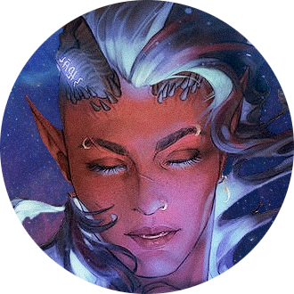

<h3 align="center" style="text-align: center"> Hi! 👋 I'm Dax. </h3>
<table align="center" style="text-align: center; border: none;">
    <tbody align="center" style="border: none;">
        <tr align="center" style="border: none;">
            <td align="center" style="border: none;"></td>
            <td align="center" style="border: none;"></td>
            <td align="center" style="border: none;"></td>
            <td align="center" style="border: none;"></td>
        </tr>
        <tr align="center" style="border: none;">
            <td align="center" style="border: none;">
                <b> Associate Data Scientist </b>  
                 Full-time 
            </td>
            <td align="center" style="border: none;">
                <b> Machine Learning Engineer </b>  
                 Part-time/Contract 
            </td>
            <td align="center" style="border: none;">
                <b> Artificial Intelligence Researcher </b>  
                 Part-time 
            </td>
            <td align="center" style="border: none;">
                <b> Adjunct Faculty </b>  
                 Computer Science 
            </td>
        </tr>
    </tbody>
</table>

---
<h3 align="center" style="text-align: center"> Work Stat-tracking </h3>

 You can stat-track my work on the <a href="https://dakilaledesma.github.io/">daxtracker.</a> 
    (this graph and the daxtracker. updates in realtime)

---
<h3 align="center" style="text-align: center"> Usernames & Profile Handles </h3>

  
     
    <b>@dakilaledesma</b> 
    Work, Instagram, and IRL-related accounts.
  
     
     
  
     
    <b>@Invuska</b> <b>OR</b> <b>@_Invuska</b> 
    Discord, Larian Forums, Reddit, and most other things. 
  

<!--
**dakilaledesma/dakilaledesma** is a ✨ _special_ ✨ repository because its `README.md` (this file) appears on your GitHub profile.

Here are some ideas to get you started:

- 🔭 I’m currently working on ...
- 🌱 I’m currently learning ...
- 👯 I’m looking to collaborate on ...
- 🤔 I’m looking for help with ...
- 💬 Ask me about ...
- 📫 How to reach me: ...
- 😄 Pronouns: ...
- ⚡ Fun fact: ...
-->
